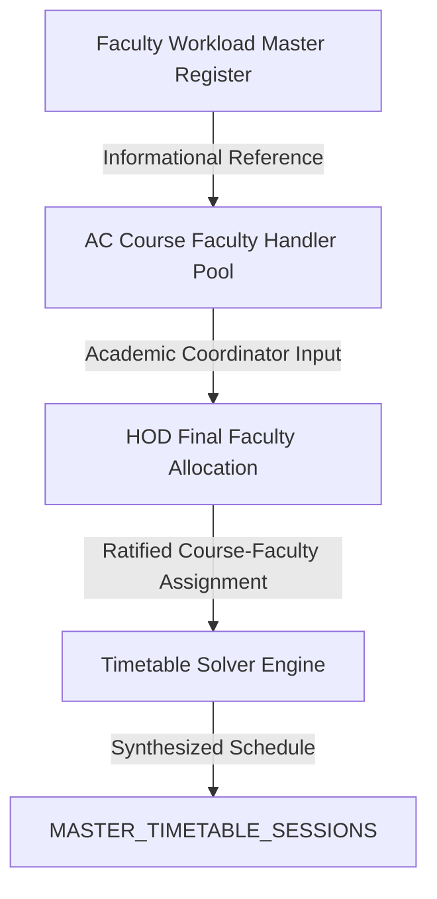

# Faculty Workload Allocation Master Module

## 1. Purpose & Core Identity

The **Faculty Workload Allocation Master Module** serves as the authoritative institutional register answering:
> *"Who is doing what work, in which academic allocation/context, and how many hours per week?"*

It is a **Master Workload Register** designed to capture individual faculty academic teaching allocations and administrative responsibilities with 100% row-level source fidelity.

### Architectural Domain Separation

It is strictly separated from other academic timetable scheduling and allocation pipelines:



- **Not the Timetable (`MASTER_TIMETABLE_SESSIONS`)**: Workload items are not scheduled time slots.
- **Not Course Faculty Handlers (`getCourseFacultyHandlers`)**: Workload items are individual faculty quotas, not course subject pools.
- **Not HOD Final Assignment (`getHODFacultyAllocations`)**: Workload items represent the master institutional baseline rather than the semester-specific HOD section assignments.

---

## 2. Authoritative Source Dataset

The module imports and preserves the complete **28-faculty workload source dataset** without summarization, omission, or artificial normalization:

- **Total Faculty Profiles**: 28
- **Total Teaching Allocation Rows**: 118
- **Total Responsibility Allocation Rows**: 59
- **Total Workload Rows**: 177
- **Total Calculated Weekly Hours**: 530 hours/week (401 Teaching + 129 Responsibility)
- **Complete/Matched Records**: 26
- **Incomplete Source Records**: 2 (`Mrs. A. Satheesh Kumar`, `Mr. P. Jaishankar`)
- **Arithmetic Source Discrepancies**: 0

### Source Data Preservation Rules
- **Names Preserved**: Exact spellings retained (e.g., `Dr. S. Karpusamy` is preserved as supplied; no silent normalization to `Karuppusamy`).
- **Designations Preserved**: Preserved as specified (e.g., `Professor & Head Of Department HOD`, `AP (Website)`, `AP (DCOE)`, `AP (Placement)`, `ASP / ECE`, `AP / Maths`).
- **Missing Course Codes**: Stored as `null` (never replaced with artificial placeholders like `"--"`).

---

## 3. Workload Data Model

Every faculty profile adheres to the following structural schema:

```typescript
interface FacultyWorkloadProfile {
  facultyId: string;                     // Unique identifier (e.g., 'FWL-01')
  facultyName: string;                   // Preserved name
  designation: string;                   // Preserved academic designation
  teaching: {
    ugTheory1: TeachingAllocation[];     // UG Theory 1 allocations
    ugTheory2: TeachingAllocation[];     // UG Theory 2 allocations
    lab1: TeachingAllocation[];          // Lab 1 allocations
    lab2: TeachingAllocation[];          // Lab 2 allocations
    pg: TeachingAllocation[];            // PG course allocations
    others: TeachingAllocation[];        // PBL, Skill Dev, NPTEL, etc.
  };
  responsibilities: Responsibility[];    // Administrative & institutional roles
  sourceTotalHours: number | null;       // Supplied total from source register
  calculatedTotalHours: number;          // teachingHours + responsibilityHours
  teachingHours: number;                 // Sum of all teaching item hours
  responsibilityHours: number;           // Sum of all responsibility item hours
  status: 'MATCHED' | 'REVIEW REQUIRED' | 'INCOMPLETE SOURCE DATA';
  isIncomplete?: boolean;
  incompleteReason?: string;
  discrepancyNote?: string | null;
}

interface TeachingAllocation {
  category: 'UG Theory 1' | 'UG Theory 2' | 'Lab 1' | 'Lab 2' | 'PG' | 'Others';
  courseCode: string | null;            // e.g. '22CSC14' or null
  courseName: string;                   // e.g. 'Principles of Compiler Design'
  allocation: string | null;            // e.g. 'UG III Year A'
  hours: number;                        // Contact hours per week
}

interface Responsibility {
  category: 'RESPONSIBILITY';
  role: string;                         // e.g. 'Class Advisor', 'NBA Coordinator'
  allocation: string | null;            // e.g. 'II Year C' or null
  hours: number;                        // Assigned weekly hours
}
```

---

## 4. Teaching & Responsibility Categories

### Teaching Categories
1. **UG Theory 1**: Primary undergraduate lecture allocations.
2. **UG Theory 2**: Secondary undergraduate lecture allocations.
3. **Lab 1**: Primary laboratory practical blocks.
4. **Lab 2**: Secondary laboratory practical blocks.
5. **PG**: Postgraduate courses (e.g. M.E. CSE subjects and advanced labs).
6. **Others**: Project-Based Learning (PBL), Skill Development, Library/NPTEL, Indian Constitution.

### Responsibility Categories
Administrative and co-curricular duties remain independent in `responsibilities[]` and are **never converted into course codes**. They are visually badged with distinct role tags:
- **HOD**: Department headship executive responsibilities.
- **Academic Coordinator**: Overall year-level academic coordination.
- **Class Advisor**: Section advisory responsibilities.
- **Proctor**: Student mentoring and counseling allocations.
- **Placement Coordinator**: Department training and placement operations.
- **Timetable Coordinator / I/C**: Master schedule orchestration.
- **Accreditation (NBA / NAAC / IQAC)**: Compliance and criterion leads.
- **PCD Club**: Programming and Competitive Coding Club mentors.
- **Lab Incharge**: Computer Centre / Specialized lab superintendence.
- **Other Portals**: Website, Newsletter, Industry Relations, Alumni, Exam Cell.

---

## 5. Total Calculation & Status Logic

Totals are deterministically computed and compared against the original source records:

$$\text{Teaching Hours} = \sum_{\text{items}} \text{teaching.hours}$$
$$\text{Responsibility Hours} = \sum_{\text{items}} \text{responsibilities.hours}$$
$$\text{Calculated Total Hours} = \text{Teaching Hours} + \text{Responsibility Hours}$$

### Status State Machine
- **`MATCHED`**: $\text{sourceTotalHours} == \text{calculatedTotalHours}$.
- **`REVIEW REQUIRED`**: Source total exists but differs from calculated total.
- **`INCOMPLETE SOURCE DATA`**: Source total was omitted or illegible in the original register.

### Incomplete Source Records
1. **Mrs. A. Satheesh Kumar (`FWL-20`)**:
   - Source allocation: `TECH GURU`
   - Total hours: Not specified / legible in source.
   - Status: Marked as `INCOMPLETE SOURCE DATA`.
2. **Mr. P. Jaishankar (`FWL-28`)**:
   - Course: `22MYB05 Discrete Mathematics BSC` (4 Hours)
   - Total weekly hours: Unspecified in source.
   - Status: Marked as `INCOMPLETE SOURCE DATA`.

---

## 6. User Interface & Screen Architecture

The UI adheres to the **Google Stitch Academic Nexus** visual design language:
- Palette: Primary `#001428`, PrimaryContainer `#0F2942`, Accent `#0051D5`/`#2563EB`, Surface `#F8F9FF`.
- Typography: Clear hierarchy with monospace codes and chips.

### Screens:
1. **Workload Master Dashboard (`/workload`)**:
   - **Executive Metric Cards**: Total Faculty (28), Total Allocated Hours (530h), Teaching Hours (401h), Responsibility Hours (129h).
   - **Integrity Filter Strip**: Complete/Matched (26), Incomplete Data (2), Discrepancies (0).
   - **Dynamic Live Search**: Real-time multi-attribute search across faculty name, designation, course code, course name, allocation context, and roles.
   - **Role Filters**: All, HOD, Academic Coordinator, Class Advisor, Proctor, Teaching Only, Responsibilities.
   - **Teaching Category Filters**: All, UG Theory, Laboratory, PG Courses, PBL / Others.
   - **Master Register List**: Complete 28 faculty cards with metrics strip and quick role chips.
2. **Faculty Workload Detail (`/workload/[id]`)**:
   - **Executive Header**: Avatar, Name, Designation, Department, ID, and Status pill.
   - **Summary Strip**: Teaching Hours, Responsibility Hours, Total Load.
   - **Source vs Calculated Total Comparison Card**: Side-by-side comparison with audit icon and discrepancy notes.
   - **Categorized Teaching Breakdown**: UG Theory 1, UG Theory 2, Lab 1, Lab 2, PG, and Others with course codes, titles, allocation, and hours.
   - **Independent Responsibilities**: Clean cards with dedicated role badges (HOD, Proctor, Class Advisor, etc.).

---

## 7. Verification & Automated Testing

Deterministic tests in [`scripts/test-faculty-workload.js`](file:///d:/Project/NEC%20Faculty%20App/scripts/test-faculty-workload.js) execute across 14 dedicated test suites verifying:
1. **Exactly 28 faculty records**: Exact count in `FACULTY_WORKLOAD_MASTER` and processed lists.
2. **Every faculty name exists**: Preserves all 28 names with exact spellings (e.g., `Dr. S. Karpusamy` without normalization).
3. **Every designation exists**: All academic titles preserved verbatim.
4. **Every workload row exists**: Multi-row allocations retained row-by-row (e.g. 10 rows for `M. P. Thiruvenkatasuresh`).
5. **Every supplied hour exists**: Strict numeric values; course code omissions retained as `null` (not `"--"`).
6. **Supplied totals preserved**: Direct comparison with original register totals.
7. **Responsibility rows remain separate**: `category: 'RESPONSIBILITY'` without course codes.
8. **Calculated totals work**: $\text{calculatedTotal} = \text{teachingHours} + \text{responsibilityHours}$.
9. **Incomplete records marked correctly**: `Mrs. A. Satheesh Kumar` and `Mr. P. Jaishankar` marked as `INCOMPLETE SOURCE DATA` with `null` source totals.
10. **No duplicate identical workload rows**: Zero duplicates detected across all 28 profiles.
11. **Search works**: Multi-attribute search across name, designation, course code, course name, allocation context, and roles.
12. **Filters work**: Status, administrative roles, and teaching category filter combinations.
13. **Faculty detail works**: Direct ID retrieval (`FWL-01` to `FWL-28`) and record validation engine.
14. **Workload data does NOT become TimetableSession**: Strict domain separation; zero timetable pollution.

Run test command:
```bash
node scripts/test-faculty-workload.js
```
Result: **853 PASSED, 0 FAILED**.

Health & Linter:
```bash
npx expo-doctor
```
Result: **21/21 checks passed. No issues detected!**

